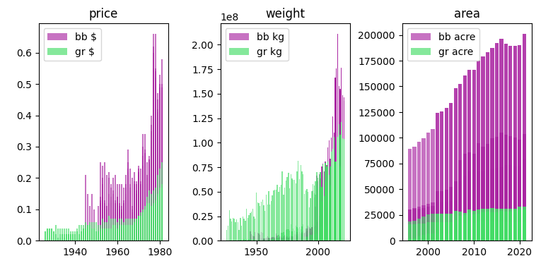

> Selective fruits price prediction for a given province

> Dataset from [Statistics Canada](https://www150.statcan.gc.ca) - Area production and farm gate value of marketed fruits

## how to use this notebook
1. notebook is titled 32100364 and needs to be loaded in jupyterlab for use
2. csv data used by the notebook is located under 32100364; the notebook, folder and source file all have the same name
3. notebook uses vanilla packages for datascience: pandas, numpy, matplotlib.pyplot, sklearn.linear_model
4. img folder contains the assets for the markdown file

## obtaining the dataset
The dataset for the purpose of this project has been obtained from Statistics Canada website. This dataset is updated annually, and holds valid for the entire geography of Canada including the territories. It consists of various commodities, which are edible fruits. The dataset contains the following features on these commodities. [Area, production and farm gate value of marketed fruits.](https://www150.statcan.gc.ca/t1/tbl1/en/tv.action?pid=3210036401)

1. geography, i.e. the province or territories where the commodity was grown or sold

2. reference date, i.e. the year for which the data was recorded

3. farm area, production, or value, to describe what kind of value is provided

4. estimates, uom, i.e. the unit representing the commodities' value, e.g. Average price per pound, Pounds

5. commodity, i.e. the name of the commodity along with its ID (we do not use the ID), e.g. Fresh blueberries [1141114]

## questions this notebook addresses
1. Are there certain commodities preferred for production/price-increase?
2. If so, does the area of cultivation also show some relation to the price change (or any other relation that can be obtained)?
3. Since it is a known fact that commodities' price increases with time, is it possible to model this relation, along with other data (such as the province)?

## towards a cleaner data
A small proportion of the dataset has null values. Fixing these cells by removing them or replacing them is an important aspect of working on any datascience project. Pandas provides some useful built-in methods that can be used for this purpose. It is important to use these methods to remove the missing values from our dataset. <u>If we skip this stage, our code might break in different places</u>. Some operations we perform on our dataset using Pandas expect the missing values to be removed.

### dropna
We can use this method to remove null values from rows or columns. We can also specify criteria to drop these cells for specific columns only using <code>subset</code>. Or, we can drop when an entire row or column has null values. Either way, this step is important. Another approach might be to fill the missing values. For example, if a column is numeric, we can use the mean value for this column to fill the missing values using the <code>fillna</code> method that Pandas provides.

    <code>df_hectare = df[df['Farm area, production, value'] == 'Hectares']</code> 
    <code>df_acre = df[df['Farm area, production, value'] == 'Acres']</code> 
    selecting dataframe for cultivated area

    <code>df_hectare = df_hectare.dropna(subset=['VALUE'],axis=0)</code> 
    <code>df_acre = df_acre.dropna(subset=['VALUE'],axis=0)</code> 
    <code></code> 
    <code>df_hectare['VALUE_acre'] = df_hectare['VALUE'] * 2.47105</code> 
    <code>df_hectare.drop('VALUE',inplace=True,axis=1)</code> 
    <code>df_hectare.rename(columns={'VALUE_acre':'VALUE'},inplace=True)</code> 
    <code></code> 
    <code>df_acre = pd.concat([df_hectare,df_acre],axis=0,ignore_index=True)</code> 
    using dropna to drop the entire row with null value

## using groups effectively

Sometimes a dataset may have a large number of categorical columns. Each of these columns can make it easy for us to get lost in the details that the dataset is providing us. When the data is originally collected, it is in a raw format. It makes more sense at that stage, to put everything in one place in the raw form. But for interpreting meaningful results, we do not need all the details.

")

We can use <code>groupby</code> on the dataframe to group one or more columns into a single index. Once that is done we can easily narrow down on any column. The results above show a small slice of the marketed production values (in <b>kg</b>) for the group <code>GEO-Commodity</code>. Note that it has also been sorted using <code>sort_values</code> to display a horizontal bar plot.

## using plots for visualizations

One of the biggest strengths of using <code>matplotlib</code> is that it enables us to put different plots in the same place. This allows for a better understanding of what the data is trying to tell. Sometimes, we can go wrong when we are looking at the data in only one way. Putting different plots together is helpful because it reduces the chances of interpreting the data in an incorrect manner.

> NOTE: As there are different commodities in this dataset, it makes sense to select a few for comparison and move ahead with them. Here, we have picked blueberries and grapes.

From the plots above, we see that there is a drastic difference in the price (<b>$</b>), production (<b>kg</b>), and cultivation (<b>acre</b>) values, for the picked commodities (blueberries and grapes in this case).

> NOTE: You might have noticed an additional detail about the year axis for the price plot. It is discussed at the end, and is not relevant for now.

For the middle plot, there seems to be some missing data between 1975 and 2000 for blueberries. Otherwise, we see a very clear picture that not only blueberries are priced more, but they are also cultivated more than grapes.

> Answer Time

The answer is true for the first question we wanted to address from the dataset. Since we put all the findings in one place, we can also see that the answer to the second question is also true.
                        
1. ✅ Are there certain commodities preferred for production/price-increase?
2. ✅ If so, does the area of cultivation also show some relation to the price change (or any other relation that can be obtained)?

## creating a model for the data
In order to predict, say, the future price of a commodity we need to train/fit a model. Training a model means to derive certain values from the input (X, y), that can help create simple mathematical equations to give the best approximation for the values themselves. The algorithm uses differentials (internally) to generate these values.

When we say we are training a model, it means we are calling functions that will generate these values for us. But we still need to provide the inputs (X, y). X are (could be singular) some of the columns from our dataset, and y is a column that depends on X. For e.g. X could be a column with label 'year' (containing numerical years) and y could be a column, say 'price' (containing numerical prices in $), that depends on X.

In our case, X is composed of two columns - year and province. Since we want to predict the price of a commodity, y in this case would be the price column (for the given commodity). These values do not automatically get passed onto the model. We need to select the X columns, and the y column separately. We then pass it to the model. As our model uses linear mathematical equations internally, we use the [LinearRegression](https://scikit-learn.org/stable/modules/generated/sklearn.linear_model.LinearRegression.html) model. Finally, we can call <code>LinearRegression().fit(X, y)</code> to train/fit the linear model.

## interpreting the coefficients
After training the model, we can access its properties and methods to understand the relations between X and y, and also predict y using an unknown X. This becomes clear on observing the following bar plot. Here, we simply plot using <code>plt.barh(X.columns,model.coef_)</code>. The <code>columns</code> property is a collection of columns from X, and the <code>coef_</code> property is a collection of values that signify how strongly (or weakly) a given column relates to y.

As we can see from above, y (i.e. the price of the commodity) depends <b>positively</b> on REF_DATE (i.e. price increases with increase in year) and GEOs (i.e. the province) British Columbia, Quebec, <b>while</b> y depends <b>negatively</b> on GEOs Newfoundland and Labrador, Prince Edward Island.

## obtaining the results
Since our X is composed of columns - REF_DATE and GEOs, we can put together these values inside a dictionary for better representation (it is easy to read and modify in this manner). The code below contains three dictionaries <code>priceInCanada2025</code>, <code>priceInNewBrunswick2025</code>, and <code>priceInBC2025</code>. Each dictionary encapsulates the values (X) we intend to pass to our model to predict the price (y).

    <code>priceInCanada2025 = {</code> 
    <code>&nbsp;&nbsp;&nbsp;&nbsp;'REF_DATE':2025,</code> 
    <code>&nbsp;&nbsp;&nbsp;&nbsp;'GEO_British Columbia':0,</code> 
    <code class="text-success"><i>&nbsp;&nbsp;&nbsp;&nbsp;'GEO_Canada':1,</i></code> 
    <code>&nbsp;&nbsp;&nbsp;&nbsp;'GEO_New Brunswick':0,</code> 
    <code>&nbsp;&nbsp;&nbsp;&nbsp;'GEO_Newfoundland and Labrador':0,</code> 
    <code>&nbsp;&nbsp;&nbsp;&nbsp;'GEO_Nova Scotia':0,</code> 
    <code>&nbsp;&nbsp;&nbsp;&nbsp;'GEO_Prince Edward Island':0,</code> 
    <code>&nbsp;&nbsp;&nbsp;&nbsp;'GEO_Quebec':0</code> 
    <code>}</code>

    <code>priceInNewBrunswick2025 = {</code> 
    <code>&nbsp;&nbsp;&nbsp;&nbsp;'REF_DATE':2025,</code> 
    <code>&nbsp;&nbsp;&nbsp;&nbsp;'GEO_British Columbia':0,</code> 
    <code>&nbsp;&nbsp;&nbsp;&nbsp;'GEO_Canada':0,</code> 
    <code class="text-success"><i>&nbsp;&nbsp;&nbsp;&nbsp;'GEO_New Brunswick':1,</i></code> 
    <code>&nbsp;&nbsp;&nbsp;&nbsp;'GEO_Newfoundland and Labrador':0,</code> 
    <code>&nbsp;&nbsp;&nbsp;&nbsp;'GEO_Nova Scotia':0,</code> 
    <code>&nbsp;&nbsp;&nbsp;&nbsp;'GEO_Prince Edward Island':0,</code> 
    <code>&nbsp;&nbsp;&nbsp;&nbsp;'GEO_Quebec':0</code> 
    <code>}</code>

    <code>priceInBC2025 = {</code> 
    <code>&nbsp;&nbsp;&nbsp;&nbsp;'REF_DATE':2025,</code> 
    <code class="text-success"><i>&nbsp;&nbsp;&nbsp;&nbsp;'GEO_British Columbia':1,</i></code> 
    <code>&nbsp;&nbsp;&nbsp;&nbsp;'GEO_Canada':0,</code> 
    <code>&nbsp;&nbsp;&nbsp;&nbsp;'GEO_New Brunswick':0,</code> 
    <code>&nbsp;&nbsp;&nbsp;&nbsp;'GEO_Newfoundland and Labrador':0,</code> 
    <code>&nbsp;&nbsp;&nbsp;&nbsp;'GEO_Nova Scotia':0,</code> 
    <code>&nbsp;&nbsp;&nbsp;&nbsp;'GEO_Prince Edward Island':0,</code> 
    <code>&nbsp;&nbsp;&nbsp;&nbsp;'GEO_Quebec':0</code> 
    <code>}</code>

                        
Finally, as shown in the screenshot below, we call the <code>predict</code> method on our linear model to obtain the result. To visualize, we use the <code>plot</code> function.

The plot we see above contains the price values along the y-axis. The x-axis contains the province names as labels, where, the label for Canada is used to show the average price value on the plot, and how the other provinces compare against it, in terms of the price.

> Answer Time

The answer is true for the last question we wanted to address from the dataset. We were able to successfully create a model and predict price value using X, that is composed of REF_DATE and GEO province data.
                        
3. ✅ Since it is a known fact that commodities' price increases with time, is it possible to model this relation, along with other data (such as the province)?

## areas for improvement
As we got further and further away, it [the Earth] diminished in size. Finally it shrank to the size of a marble, the most beautiful you can imagine.

### year of reference
The max value for the REF_DATE column in the dataset is very low (1981) as seen previously in the plot. This could cause problems, as REF_DATE is not relevant, and we want to predict the latest prices of the commodity. At the moment, however, the prediction for the price seems to be working fine in terms of the linear relation. In a nutshell, we should query the dataset before we create the model, to ensure that the values of interest meet the expectations. Otherwise the result that we obtain might not be relevant.

> Subset of dataframe, after sorting values using <i>REF_DATE</i>

<table class="table table-striped table-bordered table-hover table-sm">
    <thead>
        <tr style="text-align: right;">
            <th>#</th>
            <th>REF_DATE</th>
            <th>GEO</th>
            <th>Estimates</th>
            <th>Commodity</th>
            <th>Farm area, production, value</th>
            <th>VALUE</th>
        </tr>
        </thead>
        <tbody>
        <tr>
            <th>9311</th>
            <td class="table-warning">1981</td>
            <td>British Columbia</td>
            <td>Average price per pound</td>
            <td>Fresh grapes [1141147]</td>
            <td>Dollars</td>
            <td>0.25</td>
        </tr>
        <tr>
            <th>9310</th>
            <td class="table-warning">1981</td>
            <td>British Columbia</td>
            <td>Average price per pound</td>
            <td>Fresh blueberries [1141114]</td>
            <td>Dollars</td>
            <td>0.58</td>
        </tr>
        <tr>
            <th>9279</th>
            <td class="table-warning">1981</td>
            <td>Ontario</td>
            <td>Average price per pound</td>
            <td>Fresh grapes [1141147]</td>
            <td>Dollars</td>
            <td>0.17</td>
        </tr>
        <tr>
            <th>9254</th>
            <td class="table-warning">1981</td>
            <td>Quebec</td>
            <td>Average price per pound</td>
            <td>Fresh blueberries [1141114]</td>
            <td>Dollars</td>
            <td>0.49</td>
        </tr>
        <tr>
            <th>9238</th>
            <td class="table-warning">1981</td>
            <td>New Brunswick</td>
            <td>Average price per pound</td>
            <td>Fresh blueberries [1141114]</td>
            <td>Dollars</td>
            <td>0.48</td>
        </tr>
    </tbody>
</table>

### quarts and bushels
To plot the price, production, and cultivation values, corresponding dataframe had to be selected from the dataset. For the production plot, the data selected only comprises of tons, metric tonnes, and pounds. The quarts and bushels values were left out. This was because the conversion methods described online to convert from quarts and bushels to kg had some discrepancy in their calculation.

### farm gate value and other estimates
The data selected for plot left out some estimates such as farm gate value, and bearing area. These values can be added to the plots, and might be used to address other questions. Farm gate value, for example, is the price a farmer first gets paid for the commodity, and is completely separate from the value at which the commodity gets sold in the market.

